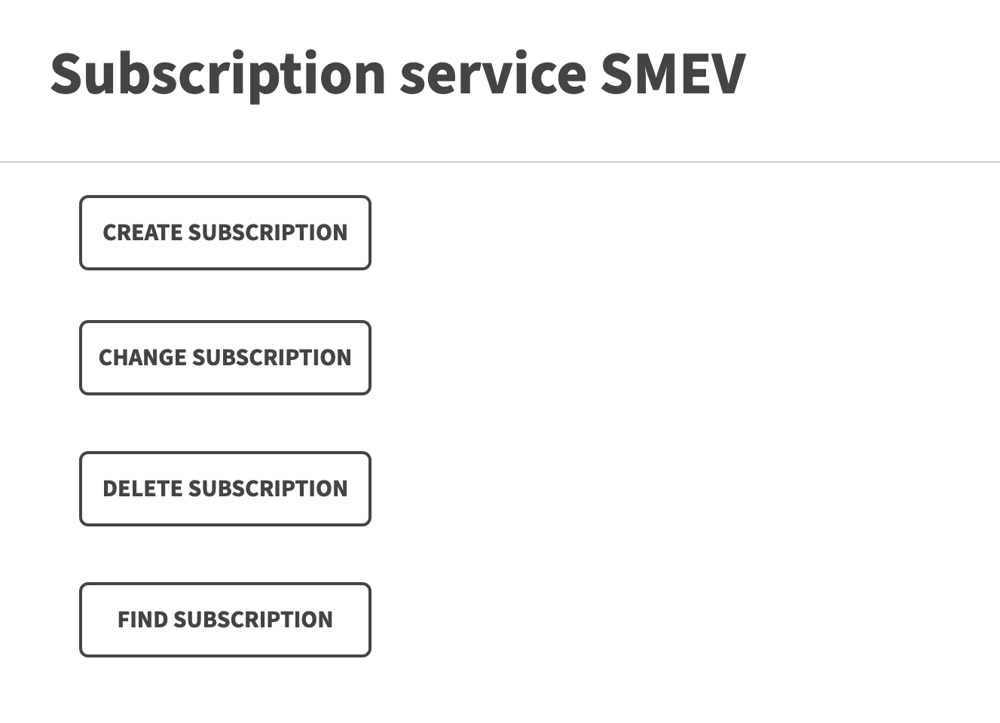

# OTUS Kotlin project

# SMEV ADAPTER

MRO SYSTEM - это коробчное решение для обработки заказов на техническое обслуживание.
Задача решения - обеспечить быстрое развертывание системы в инфраструктуре клиента.

## Визуальная схема фронтенда

## Документация

1. Маркетинг
    1. [Заинтересанты](./docs/01-marketing/02-stakeholders.md)
    2. [Целевая аудитория](./docs/01-marketing/01-target-audience.md)
    3. [Конкурентный анализ](./docs/01-marketing/03-concurrency.md)
    4. [Анализ экономики](./docs/01-marketing/04-economy.md)
    5. [Пользовательские истории](./docs/01-marketing/05-user-stories.md)

## Документация

2. DevOps
    1. [Схема инфраструктуры](./docs/02-devops/01-infrastruture.md)
    2. [Схема мониторинга](./docs/02-devops/02-monitoring.md)
